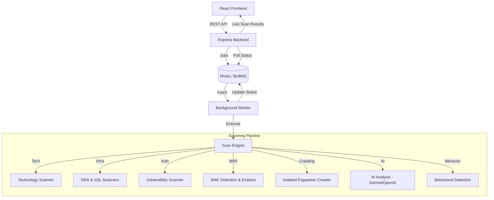
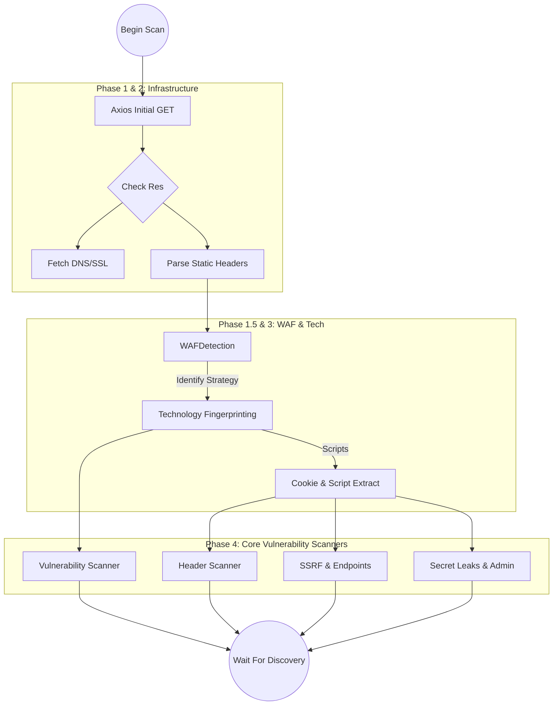
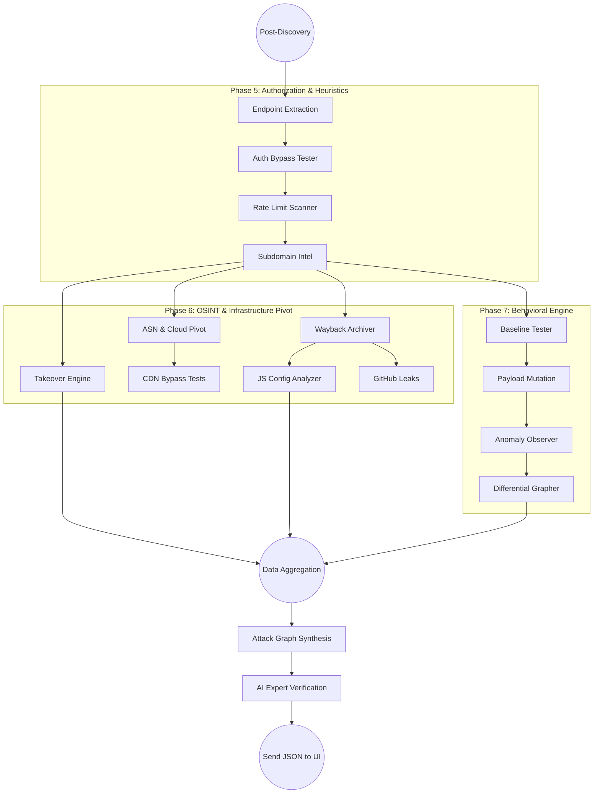
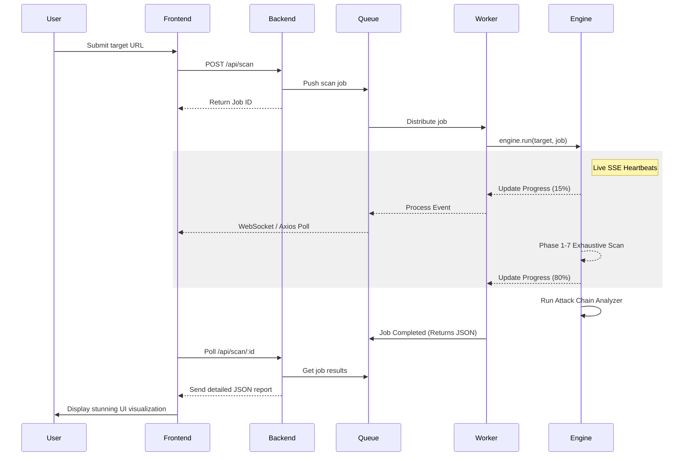

# 🛡️ Web Security Exposure Analyzer

A professional-grade, multi-phase security scanning engine designed to identify technology stacks, discover vulnerabilities, and perform behavioral analysis on web applications.


---

## 🏗️ System Architecture



---

## 🚀 The 7 Phases of Security Scanning

The analyzer operates through an evolutionary sequence of phases, moving from basic discovery to advanced behavioral intelligence. Below is the internal flow of the Engine during a Deep Scan.

### **Phase 1-4: The Discovery & Infrastructure Pipeline**



### **Phase 5-7: The Advanced Recon & Intelligence Pipeline**



---

## 📈 Cross-Service Event Flow



---

## 🛠️ Tech Stack

- **Frontend**: React 18, Vite, Lucide Icons, Framer Motion.
- **Backend**: Node.js, Express.
- **Queue System**: BullMQ / Redis.
- **Scanning Core**: Puppeteer, Axios, Cheerio.
- **Security Logic**: Custom rule engines and behavioral heuristics.
- **AI Integration**: Google Gemini / OpenAI GPT-4.

---

## ⚙️ Installation & Setup

### Prerequisites
- Node.js (v18+)
- Redis Server

### 1. Clone & Install
```bash
git clone https://github.com/akshatatcodes/web_scanner.git
cd web_scanner

# Install Backend
cd backend
npm install

# Install Frontend
cd ../frontend
npm install
```

### 2. Configure Environment
Create a `.env` file in the `backend/` directory:
```env
PORT=5000
REDIS_URL=redis://localhost:6379
GEMINI_API_KEY=your_key_here
OPENAI_API_KEY=your_key_here
```

### 3. Run the Application
```bash
# Terminal 1: Backend
cd backend
node server.js

# Terminal 2: Worker
cd backend
node worker.js

# Terminal 3: Frontend
cd frontend
npm run dev
```

---

## 🛡️ License
Distributed under the MIT License. See `LICENSE` for more information.

---

<p align="center">
  Developed by <b>Akshat Jain</b>
</p>
