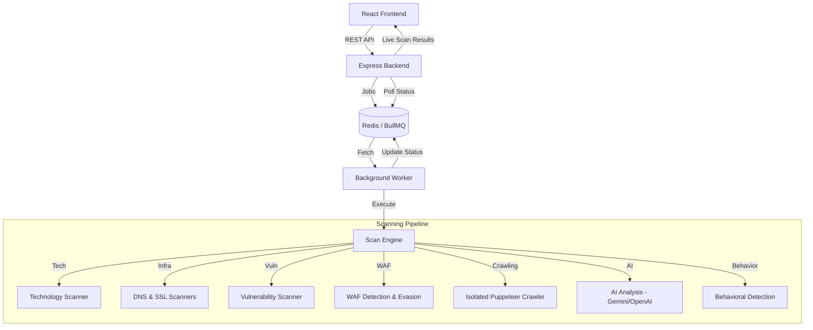
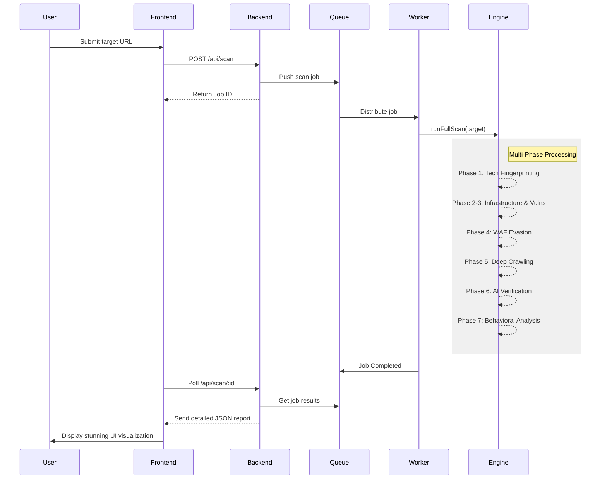

# 🛡️ Web Security Exposure Analyzer

A professional-grade, multi-phase security scanning engine designed to identify technology stacks, discover vulnerabilities, and perform behavioral analysis on web applications.


---

## 🏗️ System Architecture



---

## 🚀 The 7 Phases of Security Scanning

The analyzer operates through an evolutionary sequence of phases, moving from basic discovery to advanced behavioral intelligence.

### **Phase 1: Technology Fingerprinting (Discovery)**
- Detects over 1000+ technologies (Frontend, Backend, CMS, DBs, CDNs).
- Fingerprints web servers (Nginx, Apache, IIS) and load balancers.
- Identifies analytics tools and third-party scripts.

### **Phase 2: Infrastructure Hardening (DNS & SSL)**
- **DNS Audit**: MX, TXT (SPF/DMARC), A, and AAAA record analysis.
- **SSL/TLS Security**: Certificate validity, cipher suite evaluation, and expiry alerts.
- **Header Analysis**: CSP, HSTS, X-Frame-Options, and more.

### **Phase 3: Deep Vulnerability Assessment**
- **Injection Testing**: SQLi, XSS, and Command Injection detection.
- **Secret Leaks**: Scans for API keys, AWS creds, and private tokens.
- **JS Analysis**: Deep parsing of client-side scripts for endpoints and hardcoded secrets.

### **Phase 4: WAF Detection & Evasion Layer**
- **Fingerprinting**: Identifies WAFs like Cloudflare, Akamai, and AWS WAF.
- **Evasion Strategies**: Automatically applies URL encoding, case variation, and fragmentation to bypass filters.
- **Adaptive Payloads**: Mutates payloads based on WAF response patterns.

### **Phase 5: Isolated Crawler Architecture**
- **Puppeteer Integration**: High-fidelity crawling using headless browsers.
- **Resource Management**: Isolation of heavy browser processes to prevent engine stalls.
- **Event Loop Optimization**: Yielding mechanisms to allow background lock renewals (Redis/BullMQ).

### **Phase 6: AI-Powered Intelligence**
- **Vulnerability Explanation**: Detailed breakdowns of identified risks using Gemini/OpenAI.
- **Confidence Scoring**: Reduces false positives through AI-driven verification.
- **Remediation**: Generates tailored code fixes and security recommendations.

### **Phase 7: Behavioral Detection Engine**
- **Anomaly Detection**: Tracks timing and size variations in server responses.
- **Response Comparison**: Observes how servers react to subtly mutated payloads.
- **Differential Analysis**: Compares server side-effects (e.g., error logs, timing changes) across different inputs.

---

## 📈 Scan Flow



---

## 🛠️ Tech Stack

- **Frontend**: React 18, Vite, Lucide Icons, Framer Motion.
- **Backend**: Node.js, Express.
- **Queue System**: BullMQ / Redis.
- **Scanning Core**: Puppeteer, Axios, Cheerio.
- **Security Logic**: Custom rule engines and behavioral heuristics.
- **AI Integration**: Google Gemini / OpenAI GPT-4.

---

## ⚙️ Installation & Setup

### Prerequisites
- Node.js (v18+)
- Redis Server

### 1. Clone & Install
```bash
git clone https://github.com/akshatatcodes/web_scanner.git
cd web_scanner

# Install Backend
cd backend
npm install

# Install Frontend
cd ../frontend
npm install
```

### 2. Configure Environment
Create a `.env` file in the `backend/` directory:
```env
PORT=5000
REDIS_URL=redis://localhost:6379
GEMINI_API_KEY=your_key_here
OPENAI_API_KEY=your_key_here
```

### 3. Run the Application
```bash
# Terminal 1: Backend
cd backend
node server.js

# Terminal 2: Worker
cd backend
node worker.js

# Terminal 3: Frontend
cd frontend
npm run dev
```

---

## 🛡️ License
Distributed under the MIT License. See `LICENSE` for more information.

---

<p align="center">
  Developed by <b>Akshat Jain</b>
</p>
